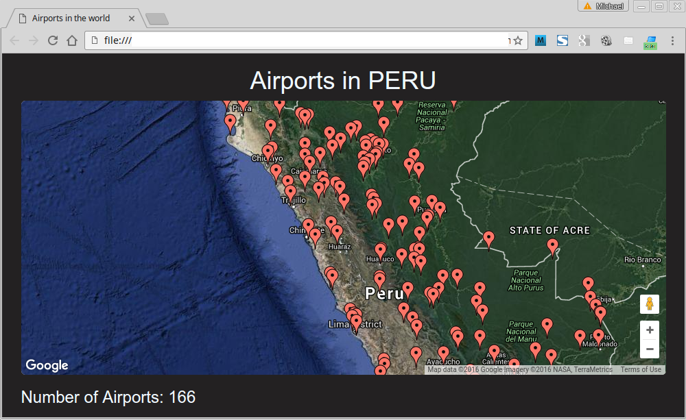

#AIRPORTS IN THE WORLD

This small project concerns about drawing all airports and heliports from a choosen country  using python,SQLite,HTML,Javascript and Google Maps API.

##Steps

0. Clone the project or just download the ZIP package.

1. Run **_myAirports.py_** .It will download the database of all world airports from 
[http://ourairports.com](http://ourairports.com/data/airports.csv) and a list of countries and their equivalent ISO_3166 code from [here](https://commondatastorage.googleapis.com/ckannet-storage/2011-11-25T132653/iso_3166_2_countries.csv). After that the script will create a SQLite database to storage the information.

2. Run **_myCountry.py_** . It will show you two options:
  * (1) Choose this if you want to discover a country Int. Code
  * (2) Choose this if you know the country Int. Code

3. After that open the file **myAirports.html** in your browser.

4. If you wish to generate other graphic just rerun **_myCountry.py_** and refresh the browser.

